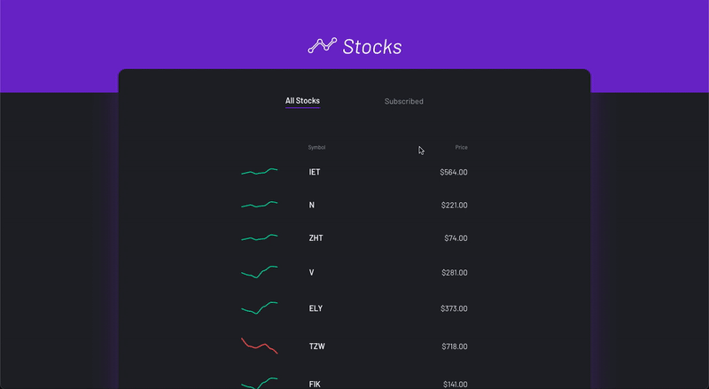

# 📈 Stocks React App

This project is a WEB App to track stocks and their prices. \
**`Note: All the stocks data in this project are FAKE!`**

## Running the App

1. Clone the app with `git clone`.
2. Access the repository folder and run `yarn` to install all dependencies.
3. `yarn start` to run the app in development mode.
